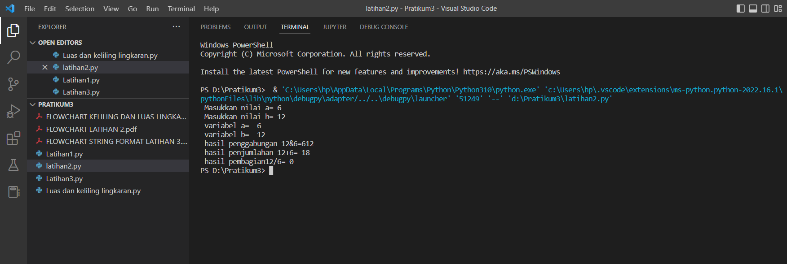

# Pratkum3

# Latihan 1

# 1. Parameter end
Parameter end berfungsi untuk mengganti karakter terakhir bawaan yang dicetak dilayar. Jadi secara bawaan, setiap kali kita memanggil fungsi print() untuk mencetar sesuat, python akan mencetak ganti baris () di setiap output.
contoh pada gambar dibawah ini:

# 2. Separator
sep adalah pemisah(separator) yang berfungsi sebagai tanda pemisah antar objek yang dicetak. Defaultnya adalah tanda spasi. contoh ada pada gambar dibawah ini:

# 3. String format
Fungsi format() berfungsi untuk melakukan pengaturan format string yang akan dicetak atau ditampilkan ke monitor. contoh ada pada gambar dibawah ini:

# Latihan 2

# Input dan output variabel a dan b
membuat variabel a dan b dan mengisikan variabel tersebut value type class string, lalu menggabungkan, menambahkan dan membagikannya menggunakan string formating

1. membuat variabel a,b dan input value variabel a, b
2. format hasil penggabungan
3. format hasil penjumlahan
4. format hasil pembagian contoh kode programnya sebagai berikut:

Hasil dari Kode programnya adalah :

# Latihan 3

# String formating membuat pola bintang ketupat 
fungsi format untuk melakukan pengaturan format string yang akan dicetak atau ditampilkan ke monitor sesuai dengan format yang kita buat.

1. Buat variabel a dan isi variabel tersebut dengan bintang (*),
2. type class pada variabel a akan menjadi type string
3. Membuat program string format {0:>10-14} artinya value 0 akan berada di posisi lebih besar dari 10 sampai 14 format{a1,3,5,7,9} artinya variabel a yang berisi () akan di kalikan 1, 3, 5, 7, dan 9 di masing masing format yang akan kita buat, dan variabel a tersebut akan di masukkan kedalam format{0:>10-14}, jadi posisi variabel a akan berada di posisi value 0 tersebut. untuk lebih jelas nya liat kode program di bawah ini:

Hasil dari Kode programnya adalah:

# Menghitung Luas dan Keliling Lingkaran
1. Luas Lingkaran dan Keliling Lingkaran
- Input diameter(d), jari-jari(r), phi, L dan K
- Menghitung L = phi * (r*r)
- Menghitung K = phi * d
- output Luas Lingkaran dan Keliling Lingkaran(print L dan K)

hasil dari Kode perogramnya adalah:
